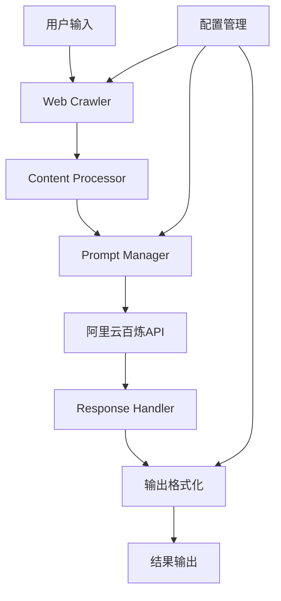
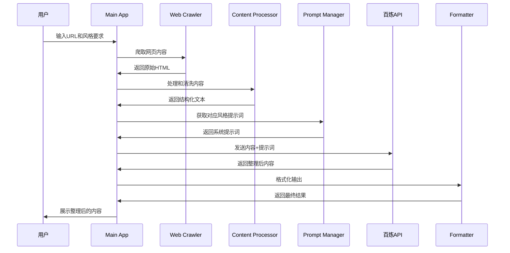

# Web Content Agent 设计文档

## 概览 (Overview)

本项目设计一个基于 Python 的网页内容整理 Agent，集成阿里云百炼大模型 API，实现网页内容的智能爬取、整理和归纳输出。系统支持自定义提示词模板，可适配不同的输出风格（如小红书风格）。

核心功能：
- 网页内容智能爬取
- 基于大模型的内容整理与归纳
- 可定制化的输出风格
- 精简务实的架构设计

## 架构设计 (Architecture)

### 系统架构图



### 核心组件

#### 1. Web Crawler (网页爬取模块)
- **功能**: 负责网页内容的获取和预处理
- **技术栈**: requests + BeautifulSoup4
- **特性**: 支持反爬虫策略、内容清洗

#### 2. Content Processor (内容处理模块)
- **功能**: 网页内容的结构化处理和关键信息提取
- **处理流程**: HTML解析 → 文本提取 → 内容分块

#### 3. Prompt Manager (提示词管理模块)
- **功能**: 管理和定制化系统提示词
- **支持**: 多种风格模板（小红书、正式报告等）
- **配置**: 基于 YAML/JSON 的模板管理

#### 4. AI Service (大模型服务模块)
- **API**: 阿里云百炼大模型
- **功能**: 内容理解、整理、归纳
- **优化**: 请求频率控制、错误重试机制

#### 5. Output Formatter (输出格式化模块)
- **功能**: 根据配置格式化最终输出
- **支持格式**: Markdown、HTML、纯文本

### 技术栈选择

- **核心语言**: Python 3.8+
- **HTTP 客户端**: requests
- **HTML 解析**: BeautifulSoup4
- **配置管理**: PyYAML
- **日志系统**: Python logging
- **环境管理**: python-dotenv
- **API 客户端**: 阿里云百炼 SDK

### 目录结构

```
web_content_agent/
├── src/
│   ├── __init__.py
│   ├── crawler/
│   │   ├── __init__.py
│   │   └── web_crawler.py
│   ├── processor/
│   │   ├── __init__.py
│   │   └── content_processor.py
│   ├── ai/
│   │   ├── __init__.py
│   │   └── bailian_client.py
│   ├── prompt/
│   │   ├── __init__.py
│   │   └── prompt_manager.py
│   └── formatter/
│       ├── __init__.py
│       └── output_formatter.py
├── config/
│   ├── settings.yaml
│   └── prompts/
│       ├── xiaohongshu.yaml
│       └── formal.yaml
├── main.py
├── requirements.txt
└── .env
```

### 核心工作流程



### 配置系统设计

#### settings.yaml
```yaml
api:
  bailian:
    endpoint: "your-endpoint"
    api_key: "your-api-key"
    model: "qwen-max"
    
crawler:
  timeout: 30
  headers:
    User-Agent: "WebContentAgent/1.0"
  
output:
  default_format: "markdown"
  max_length: 2000
```

#### 提示词模板示例 (xiaohongshu.yaml)
```yaml
name: "小红书风格"
description: "小红书图文风格的内容整理"
system_prompt: |
  你是一个专业的内容整理助手，请将网页内容整理成小红书风格的图文内容：
  - 使用活泼生动的语言
  - 适当添加emoji表情
  - 突出重点信息
  - 保持内容的可读性和吸引力
  - 字数控制在500-800字
user_prompt: "请将以下网页内容整理成小红书风格的文案：\n{content}"
```

### 扩展性考虑

1. **多模型支持**: 预留接口支持其他大模型
2. **插件化架构**: 爬虫和处理器支持插件扩展
3. **缓存机制**: 对相同URL的内容进行缓存优化
4. **批量处理**: 支持多个URL的批量处理
5. **API接口**: 可封装为REST API服务